# `ht-issue-loop` Workflow Map

Use this map to understand the complete workflow before executing the detailed instructions in
`SKILL.md`. The diagram is an overview, while `SKILL.md` is authoritative when details differ.

## Role legend

- **Human**: supplies the issue and makes the final merge or recovery decision.
- **Hermes orchestrator**: owns Git, GitHub, CI inspection, review orchestration, and handoffs.
- **Codex worker**: changes the working tree and runs local validation only.
- **Claude/Codex reviewers**: review without changing the implementation.

## End-to-end flowchart

```mermaid
flowchart TD
    H0["Human supplies one GitHub issue URL"]:::human
    T0["Every orchestrator turn<br/>Recovery sweep"]:::orchestrator
    T1{"Non-terminal durable phase?"}:::decision
    T2["Reconcile process, artifact,<br/>hashes, SHA, and quiescence"]:::orchestrator
    T3{"Reconciliation result?"}:::decision
    M0{"New run or explicit resume?"}:::decision
    O0["New-run preflight<br/>Require clean tree and unused branch"]:::orchestrator
    O1["Fetch issue exactly once<br/>Save immutable issue snapshot"]:::orchestrator
    O2["Create issue branch from latest default branch"]:::orchestrator
    D0["Atomically persist durable run state<br/>under HERMES_HOME"]:::orchestrator
    D1["Capture canonical worker baseline<br/>Validate full pre-launch state"]:::orchestrator
    D2{"Pre-launch valid?"}:::decision
    U0["Restore durable state and snapshot<br/>Do not fetch issue"]:::orchestrator
    U1{"State, repo, branch, HEAD,<br/>snapshot and tree match?"}:::decision
    U2{"Last durable phase?"}:::decision
    W0["Codex implementation worker<br/>Snapshot in prompt; local changes and validation only"]:::worker
    O13["Reconcile worker completion<br/>Identity + output and tree quiescence"]:::orchestrator
    Q2{"Completion status?"}:::decision
    Q3{"Explicit resume request<br/>or Human approved salvage?"}:::decision
    O3{"Post-worker side-effect<br/>safety check passed?"}:::decision
    Q0{"Required report information<br/>is complete?"}:::decision
    O12["One read-only report repair<br/>No fixed heading count"]:::orchestrator
    O14["Reconcile report-repair completion<br/>Atomic exit + quiescence"]:::orchestrator
    Q1{"Repair complete with<br/>no side effects?"}:::decision
    S0["Stop: orchestration failure<br/>Preserve and report evidence"]:::stop

    R0["Three local reviews on exact diff<br/>Codex review + Claude code + security"]:::reviewer
    R1{"Any high-priority finding?"}:::decision
    L0{"Shared fix count<br/>below 10?"}:::decision
    W1["Codex restricted local fix worker"]:::worker
    F0["Fix-limit at-mention progress comment<br/>PR if created; otherwise issue"]:::stop
    H1["Human decides whether to continue manually<br/>or start a new run"]:::human

    O5["Full validation and signing preflight"]:::orchestrator
    O6["Hermes creates signed commit<br/>durably pushes and reconciles exact HEAD"]:::orchestrator
    G0{"Signoff required<br/>by this repository?"}:::decision
    G1["Sign off and verify<br/>exact pushed HEAD"]:::orchestrator
    O11["Open draft PR"]:::orchestrator
    R2["Two post-publication checks on exact PR head<br/>PR review + fresh-worktree behavior"]:::reviewer
    R3{"Three retained local reviews + two post-publication checks<br/>complete with zero high findings?"}:::decision
    L1{"Shared fix count<br/>below 10?"}:::decision
    W2["Codex restricted PR or CI fix worker"]:::worker
    O9["Reconcile worker, safety check, and validation<br/>Hermes signs, commits, durably pushes and reconciles"]:::orchestrator
    G2{"Signoff required<br/>by this repository?"}:::decision
    G3["Re-sign off and verify<br/>new pushed HEAD"]:::orchestrator

    C0["Inspect every PR CI check<br/>for the reviewed head SHA"]:::orchestrator
    C1{"CI state?"}:::decision
    C2["Continue background monitoring<br/>then read complete check set again"]:::orchestrator
    C3{"Red failure actionable<br/>from repository?"}:::decision
    S1["Stop: preserve ready PR<br/>Report CI or infrastructure blocker"]:::stop
    C4{"PR head still equals<br/>reviewed and green-CI SHA?"}:::decision

    O7["Immediately update and verify PR body<br/>Mark PR ready"]:::orchestrator
    O8["At-mention Human<br/>Five reviews passed; CI monitoring continues"]:::orchestrator
    H2["Human begins review<br/>Waits for final green-CI handoff before merge"]:::human
    O10["Update CI result and at-mention Human again<br/>All applicable CI is green"]:::orchestrator
    H3["Human performs final review<br/>and decides whether to merge"]:::human

    H0 --> T0 --> T1
    T1 -- "No" --> M0
    T1 -- "Yes" --> T2 --> T3
    T3 -- "Valid completed artifact" --> U2
    T3 -- "Still running: no duplicate" --> S0
    T3 -- "Dead without artifact" --> S0
    T3 -- "Stale SHA" --> R2
    M0 -- "New" --> O0 --> O1 --> O2 --> D0 --> D1 --> D2
    D2 -- "No: worker not started" --> S0
    D2 -- "Yes" --> W0
    M0 -- "Resume" --> U0 --> U1
    U1 -- "No" --> S0
    U1 -- "Yes" --> U2
    U2 -- "Worker incomplete" --> O13
    U2 -- "Before worker" --> D1
    U2 -- "Worker complete" --> R0
    W0 --> O13 --> Q2
    Q2 -- "indeterminate" --> S0
    Q2 -- "confirmed" --> O3
    Q2 -- "salvageable" --> Q3
    Q3 -- "No" --> S0
    Q3 -- "Yes" --> O3
    O3 -- "No" --> S0
    O3 -- "Yes" --> Q0
    Q0 -- "Yes" --> R0 --> R1
    Q0 -- "No" --> O12 --> O14 --> Q1
    Q1 -- "No" --> S0
    Q1 -- "Yes" --> R0
    R1 -- "Yes" --> L0
    L0 -- "Yes: increment" --> W1 --> O13
    L0 -- "No: 10 fixes used" --> F0 --> H1
    R1 -- "No" --> O5 --> O6 --> G0
    G0 -- "No" --> O11 --> R2 --> R3
    G0 -- "Yes" --> G1 --> O11
    R3 -- "No" --> L1
    L1 -- "Yes: increment" --> W2 --> O9 --> G2
    G2 -- "No" --> R2
    G2 -- "Yes" --> G3 --> R2
    L1 -- "No: 10 fixes used" --> F0
    R3 -- "Yes" --> O7 --> O8
    O8 -- "Human review" --> H2
    O8 -- "Background CI monitor" --> C0 --> C1
    C1 -- "Pending" --> C2 --> C0
    C1 -- "Red" --> C3
    C3 -- "No" --> S1
    C3 -- "Yes" --> L1
    C1 -- "Green" --> C4
    C4 -- "No: head changed" --> R2
    C4 -- "Yes" --> O10 --> H3

    classDef human fill:#fff2cc,stroke:#8a6d1d,color:#332800,stroke-width:2px;
    classDef orchestrator fill:#d9eaff,stroke:#245a9a,color:#102a43,stroke-width:2px;
    classDef worker fill:#dff4df,stroke:#317a31,color:#173b17,stroke-width:2px;
    classDef reviewer fill:#eee2ff,stroke:#7048a8,color:#2f1c47,stroke-width:2px;
    classDef decision fill:#ffffff,stroke:#555555,color:#222222,stroke-width:2px;
    classDef stop fill:#ffe0e0,stroke:#a33a3a,color:#551b1b,stroke-width:2px;
```

## Invariants visible in the map

1. Only Hermes mutates Git history, remotes, PRs, issues, or PR readiness.
2. New runs fetch once; resume runs restore the matching durable snapshot and never refetch.
3. Durable state is atomically updated under `$HERMES_HOME`; conversation context is not state.
4. Completion is explicitly `confirmed`, `salvageable`, or `indeterminate`; salvage retains an
   unknown worker exit status and requires independent validation.
5. Every background worker must be stopped with stable output and tree before checks or reporting.
6. Every Codex implementation or fix is followed by the mandatory side-effect check.
7. Worker reports are judged by required information, never heading count; missing information
   gets one read-only repair attempt before stopping.
8. A changed head SHA invalidates earlier review and CI evidence.
9. Signoff is skipped unless repository evidence sets `signoff_required=true`; installation alone
   is not evidence.
10. In required mode, every pushed commit is signed off again before reviews run for that HEAD.
11. CI repairs pass through the same conditional publication path.
12. Human review starts immediately after five clean reviews; CI monitoring continues in parallel.
13. The Human receives a second at-mention only when CI is green for that same reviewed SHA.
14. The workflow never merges or closes the issue; the final decision belongs to the Human.
15. Canonical pre-launch validation happens before every worker; rejection durably proves that
    no child was started.
16. Lifecycle evidence distinguishes spawn failure from post-exit artifact publication failure.
17. Pushes use one long-running background wrapper; numeric exit, full process-tree/output
    quiescence, and exact remote/upstream postconditions are all required before signoff or PR work.
18. Notifications only prompt reconciliation. Every turn recovers valid completed artifacts and
    continues unblocked phases without rerunning completed operations.
19. Reviewer state distinguishes `reviewer_running`, `reviewer_artifact_published`,
    `reviewer_reconciled`, and `review_gate_complete`.
