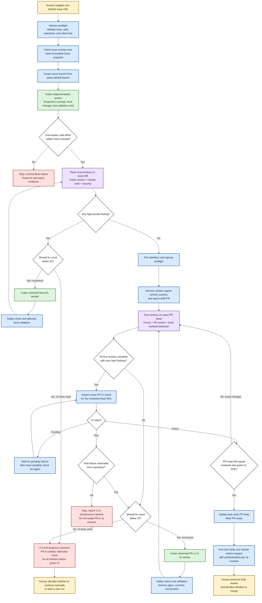

# `omh-issue-loop` Workflow Map

Use this map to understand the complete workflow before executing the detailed instructions in
`SKILL.md`. The diagram is an overview, while `SKILL.md` is authoritative when details differ.

## Role legend

- **Human**: supplies the issue and makes the final merge or recovery decision.
- **Hermes orchestrator**: owns Git, GitHub, CI inspection, review orchestration, and handoffs.
- **Codex worker**: changes the working tree and runs local validation only.
- **Claude/Codex reviewers**: review without changing the implementation.

## End-to-end flowchart

## Invariants visible in the map

1. Only Hermes mutates Git history, remotes, PRs, issues, or PR readiness.
2. Every child receives the same immutable issue snapshot; no child fetches the issue.
3. Every Codex implementation or fix is followed by the mandatory side-effect check.
4. A changed head SHA invalidates earlier review and CI evidence.
5. CI repairs pass through the same fix, validation, review, signed commit, and push path.
6. The successful Human at-mention occurs only after all reviews and CI are green for one SHA.
7. The workflow never merges or closes the issue; the final decision belongs to the Human.
